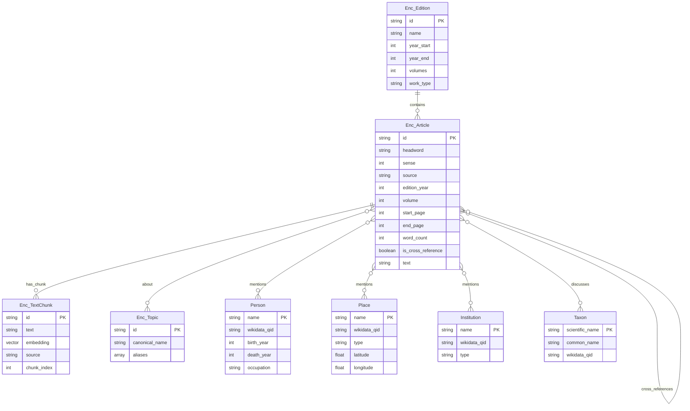

# Encyclopedia Evolution Knowledge Graph - Schema Visualization

## Entity-Relationship Diagram



## Graph Visualization (Neo4j Style)

```
                                    ┌─────────────────┐
                                    │   Enc_Edition   │
                                    │─────────────────│
                                    │ id              │
                                    │ name            │
                                    │ year_start      │
                                    │ year_end        │
                                    │ volumes         │
                                    │ work_type       │
                                    └────────┬────────┘
                                             │
                                      [:IN_EDITION]
                                             │
                                             ▼
    ┌──────────────────────────────────────────────────────────────────────────┐
    │                              Enc_Article                                  │
    │──────────────────────────────────────────────────────────────────────────│
    │ id, headword, sense, source, edition_year, volume, start_page, end_page  │
    │ word_count, is_cross_reference, text, text_preview                       │
    └───┬──────────────┬──────────────┬──────────────┬──────────────┬──────────┘
        │              │              │              │              │
        │              │              │              │              │
   [:ABOUT]     [:HAS_CHUNK]   [:EVOLVED_TO]  [:CROSS_REFS]   [:MENTIONS]
        │              │              │              │              │
        ▼              ▼              │              │              ▼
┌─────────────┐ ┌─────────────┐      │              │    ┌─────────────────────┐
│  Enc_Topic  │ │Enc_TextChunk│      │              │    │   SHARED ENTITIES   │
│─────────────│ │─────────────│      │              │    │   (Banks + Ency)    │
│ id          │ │ id          │      │              │    │─────────────────────│
│ canonical   │ │ text        │      ▼              ▼    │                     │
│ aliases[]   │ │ embedding   │  ┌────────┐    ┌────────┐│  ┌───────────────┐  │
└─────────────┘ │ chunk_index │  │Article │    │Article ││  │    Person     │  │
                └─────────────┘  │ (prev) │    │ (same) ││  │───────────────│  │
                                 │ edition│    │ edition││  │ name          │  │
                                 └────────┘    └────────┘│  │ wikidata_qid  │  │
                                                         │  │ birth/death   │  │
                                                         │  └───────────────┘  │
                                                         │                     │
                                                         │  ┌───────────────┐  │
                                                         │  │     Place     │  │
                                                         │  │───────────────│  │
                                                         │  │ name          │  │
                                                         │  │ wikidata_qid  │  │
                                                         │  │ lat/lon       │  │
                                                         │  └───────────────┘  │
                                                         │                     │
                                                         │  ┌───────────────┐  │
                                                         │  │  Institution  │  │
                                                         │  │───────────────│  │
                                                         │  │ name          │  │
                                                         │  │ wikidata_qid  │  │
                                                         │  │ type          │  │
                                                         │  └───────────────┘  │
                                                         │                     │
                                                         │  ┌───────────────┐  │
                                                         │  │     Taxon     │  │
                                                         │  │───────────────│  │
                                                         │  │ scientific    │  │
                                                         │  │ common_name   │  │
                                                         │  └───────────────┘  │
                                                         └─────────────────────┘


## Cross-Project Integration with Banks Archive

```
┌─────────────────────────────────────────────────────────────────────────────────┐
│                           NEO4J DATABASE                                         │
│                                                                                  │
│  ┌────────────────────────────┐          ┌────────────────────────────┐         │
│  │     BANKS ARCHIVE          │          │   ENCYCLOPEDIA PROJECT     │         │
│  │     (source: sutro_t1,     │          │   (source: britannica_*,   │         │
│  │      dawson_1958)          │          │    lexicon_*, chambers_*)  │         │
│  │────────────────────────────│          │────────────────────────────│         │
│  │                            │          │                            │         │
│  │  ┌──────────────────┐      │          │      ┌──────────────────┐  │         │
│  │  │    Document      │      │          │      │   Enc_Article    │  │         │
│  │  │   (7,124 nodes)  │      │          │      │  (~100K+ nodes)  │  │         │
│  │  └────────┬─────────┘      │          │      └────────┬─────────┘  │         │
│  │           │                │          │               │            │         │
│  │     [:MENTIONS]            │          │         [:MENTIONS]        │         │
│  │           │                │          │               │            │         │
│  │           ▼                │          │               ▼            │         │
│  │  ┌──────────────────┐      │          │      ┌──────────────────┐  │         │
│  │  │   TextChunk      │      │          │      │  Enc_TextChunk   │  │         │
│  │  │  (7,404 nodes)   │      │          │      │   (for RAG)      │  │         │
│  │  │  embedding: 3072 │      │          │      │  embedding: 3072 │  │         │
│  │  └──────────────────┘      │          │      └──────────────────┘  │         │
│  │                            │          │                            │         │
│  └────────────┬───────────────┘          └───────────────┬────────────┘         │
│               │                                          │                      │
│               │         ┌──────────────────────┐         │                      │
│               │         │   SHARED ENTITIES    │         │                      │
│               │         │   (Wikidata-linked)  │         │                      │
│               │         │──────────────────────│         │                      │
│               │         │                      │         │                      │
│               └────────►│  ┌────────────────┐  │◄────────┘                      │
│                         │  │     Person     │  │                                │
│                         │  │  (6,441 nodes) │  │                                │
│                         │  │  wikidata_qid  │──┼──► Enables cross-project       │
│                         │  └────────────────┘  │     queries: "Which people     │
│                         │                      │     in Banks letters have      │
│                         │  ┌────────────────┐  │     encyclopedia articles?"    │
│                         │  │     Place      │  │                                │
│                         │  │  (2,590 nodes) │  │                                │
│                         │  │  wikidata_qid  │  │                                │
│                         │  └────────────────┘  │                                │
│                         │                      │                                │
│                         │  ┌────────────────┐  │                                │
│                         │  │  Institution   │  │                                │
│                         │  │  (1,096 nodes) │  │                                │
│                         │  └────────────────┘  │                                │
│                         │                      │                                │
│                         │  ┌────────────────┐  │                                │
│                         │  │  Commodity     │  │                                │
│                         │  │  (2,308 nodes) │  │                                │
│                         │  └────────────────┘  │                                │
│                         │                      │                                │
│                         │  ┌────────────────┐  │                                │
│                         │  │     Taxon      │  │                                │
│                         │  │   (835 nodes)  │  │                                │
│                         │  └────────────────┘  │                                │
│                         │                      │                                │
│                         └──────────────────────┘                                │
│                                                                                  │
└─────────────────────────────────────────────────────────────────────────────────┘
```

## Article Evolution Across Editions

```
1704           1728           1771           1778           1797           1810           1815
Lexicon        Chambers       Brit 1st       Brit 2nd       Brit 3rd       Brit 4th       Brit 5th
   │              │              │              │              │              │              │
   ▼              ▼              ▼              ▼              ▼              ▼              ▼
┌──────┐      ┌──────┐      ┌──────┐      ┌──────┐      ┌──────┐      ┌──────┐      ┌──────┐
│ASTRO-│      │ASTRO-│      │ASTRO-│      │ASTRO-│      │ASTRO-│      │ASTRO-│      │ASTRO-│
│NOMY  │─────►│NOMY  │─────►│NOMY  │─────►│NOMY  │─────►│NOMY  │─────►│NOMY  │─────►│NOMY  │
│      │      │      │      │      │      │      │      │      │      │      │      │      │
│ 2000 │      │ 5000 │      │ 8000 │      │15000 │      │25000 │      │35000 │      │40000 │
│words │      │words │      │words │      │words │      │words │      │words │      │words │
└──────┘      └──────┘      └──────┘      └──────┘      └──────┘      └──────┘      └──────┘
                              [:EVOLVED_TO]

              Tracking knowledge expansion over 100+ years
```

## Relationship Types

| Relationship | From | To | Properties |
|--------------|------|-----|------------|
| `IN_EDITION` | Enc_Article | Enc_Edition | - |
| `ABOUT` | Enc_Article | Enc_Topic | - |
| `HAS_CHUNK` | Enc_Article | Enc_TextChunk | - |
| `EVOLVED_TO` | Enc_Article | Enc_Article | headword_match, text_similarity, word_count_change |
| `SAME_TOPIC_AS` | Enc_Article | Enc_Article | spelling_variant, similarity |
| `CROSS_REFERENCES` | Enc_Article | Enc_Article | type ("see" / "see_also"), context |
| `MENTIONS` | Enc_Article | Person/Place/Institution | count, contexts[] |
| `DISCUSSES` | Enc_Article | Taxon/Commodity | - |

## Query Isolation Patterns

### Encyclopedia Only
```cypher
MATCH (a:Enc_Article)
WHERE a.source STARTS WITH 'britannica'
RETURN a.headword, a.edition_year
```

### Banks Only
```cypher
MATCH (d:Document)
WHERE d.source IN ['sutro_t1', 'dawson_1958']
RETURN d.summary
```

### Cross-Project (via Shared Entities)
```cypher
// People in both projects
MATCH (p:Person)<-[:MENTIONS]-(a:Enc_Article)
MATCH (p)<-[:MENTIONED_IN|AUTHORED|RECEIVED]-(d:Document)
WHERE d.source = 'dawson_1958'
RETURN p.name, count(DISTINCT a) as articles, count(DISTINCT d) as letters
```
